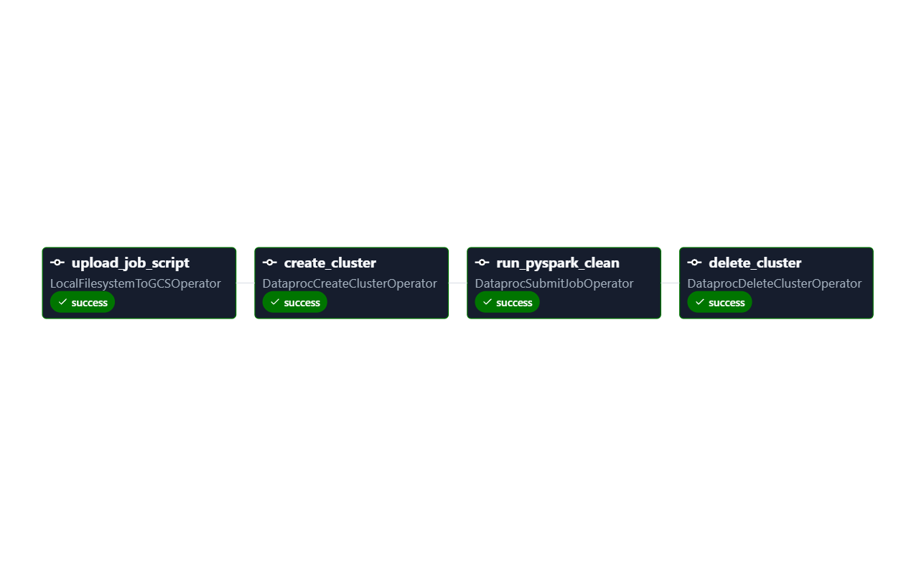
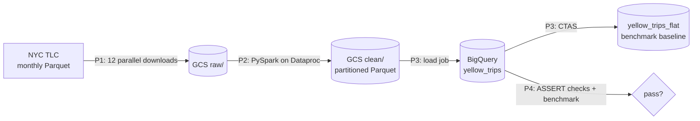

# NYC Taxi Batch Pipeline on GCP

An end-to-end batch pipeline orchestrated with **Apache Airflow 3**: it ingests a year of NYC Yellow Taxi trip data into Cloud Storage, cleans it with **PySpark on an ephemeral Dataproc cluster**, loads it into **BigQuery** (partitioned + clustered), then gates the result with SQL data quality checks and a cost benchmark.
### 📊 Cost Optimization Dashboard

[**View BigQuery Cost & Performance Metrics →**](https://datastudio.google.com/reporting/53073bc3-5adf-4a6c-a5ca-86383c78b648)

Cost optimization Dashboard: (docs/dashboard.png)

**Benchmark methodology**: The same analytical queries were executed against an unpartitioned baseline table and a partitioned + clustered table, with BigQuery query caching disabled. bytes_scanned measures the amount of data read by each query, while runtime_ms captures query execution time.



## Architecture



`p0_nyc_taxi_end_to_end` chains the four stages and waits for each to succeed.

| DAG | What it does |
|---|---|
| `p1_land_nyc_taxi_to_gcs` | Dynamic task mapping: one task per month, idempotent (skips files already in GCS), then a verify task fails on missing or empty files |
| `p2_clean_taxi_dataproc` | Uploads the job script, creates a single-node Dataproc cluster, runs PySpark, deletes the cluster (`trigger_rule=all_done`, so it is removed even if the job fails) |
| `p3_load_bigquery` | Loads Parquet into a table partitioned by `pickup_date` and clustered by `pu_location_id`, plus an unpartitioned copy |
| `p4_quality_and_benchmark` | BigQuery `ASSERT` checks fail the run on any violation, then the same queries run on both tables with the cache off |

## Results (12 months of 2024)

| Metric | Value |
|---|---|
| Raw rows | 41,169,300 |
| Clean rows | 39,223,019 |
| Rejected | 1,946,281 (4.73%) |

| Query | Flat table | Partitioned + clustered | Bytes scanned saved |
|---|---|---|---|
| One day, one pickup zone | 941 MB | 2.6 MB | **99.7%** |
| One month | 628 MB | 54 MB | **91.4%** |

## Cleaning rules (PySpark)

- Every monthly file is cast to one explicit schema, because column types drift between files.
- Rows must have pickup inside the file's own month, dropoff after pickup, distance between 0 and 200 miles, fare of at least $3.00 (the 2024 NYC yellow taxi minimum), a positive total, 1 to 6 passengers (nulls kept), and a duration under 24 hours.
- Duplicates are removed on the business key: vendor, pickup, dropoff, pickup zone, dropoff zone, total amount.
- Null `passenger_count` and `rate_code_id` are kept on purpose. They belong to flex-fare trips (`payment_type = 0`), which do not record them.

## Data quality gates (P4)

No nulls in key columns, no invalid trips, no duplicate trips, `pickup_date` inside 2024, and the partitioned and flat tables hold the same number of rows.

## Run it locally

1. Create a GCP project, a bucket in the same region as your Dataproc and BigQuery dataset, and enable the Dataproc, Compute and BigQuery APIs.
2. Give the default compute service account the `dataproc.worker` and `storage.objectAdmin` roles.
3. Copy `.env.example` to `.env`, fill it in, then run `gcloud auth application-default login` and mount the credentials file into the Airflow containers (`GOOGLE_APPLICATION_CREDENTIALS`).
4. `docker compose up airflow-init && docker compose up -d`
5. In Airflow, add variables `GCS_BUCKET`, `GCP_PROJECT_ID`, `GCP_REGION`, `TAXI_MONTHS` and a `google_cloud_default` connection (project ID only).
6. Unpause all DAGs and trigger `p0_nyc_taxi_end_to_end`.

Cost: a single `n2-highmem-4` node for about 10 to 15 minutes, plus under 2 GB of storage.

## Tests and CI

`pytest` parses every DAG and checks task ordering (for example, that the cluster delete runs even after a failed job). GitHub Actions runs `ruff` and the tests on every push.

## Notes

- The organization policy blocked service account keys, so local runs authenticate with application default credentials.
- Single-node Dataproc is enough for this volume. For larger data, move to a multi-node cluster and size executors per node.

Absolutely. I’d add a short **Results / Conclusion** paragraph after the benchmark table, because it explains *why* the numbers improved rather than just showing the numbers.

### Conclusion

**Partitioning and clustering significantly reduced the amount of data BigQuery needed to scan.** Partitioning by `pickup_date` allows queries restricted to a specific date range to scan only the relevant partitions instead of the entire table. Clustering by `pu_location_id` further narrows the data scanned for pickup-zone filters within those partitions. Together, these techniques reduced bytes scanned by **99.7% for the one-day + pickup-zone query** and **91.4% for the one-month query**. This demonstrates how physical table design can substantially reduce BigQuery query costs while improving query performance.

```markdown
| Query pattern | Flat table | Partitioned + clustered | Bytes scanned saved |
|---|---:|---:|---:|
| One day, one pickup zone | 941 MB | 2.6 MB | **99.7%** |
| One month | 628 MB | 54 MB | **91.4%** |

### What the benchmark shows

Partitioning by `pickup_date` allows BigQuery to scan only the relevant date partitions instead of the entire table. Clustering by `pu_location_id` further reduces the data scanned when queries filter by pickup zone. Together, partitioning and clustering reduced bytes scanned by **99.7%** for the one-day + pickup-zone query and **91.4%** for the one-month query. This shows how appropriate physical table design can significantly reduce BigQuery scan costs while improving query efficiency.
```
